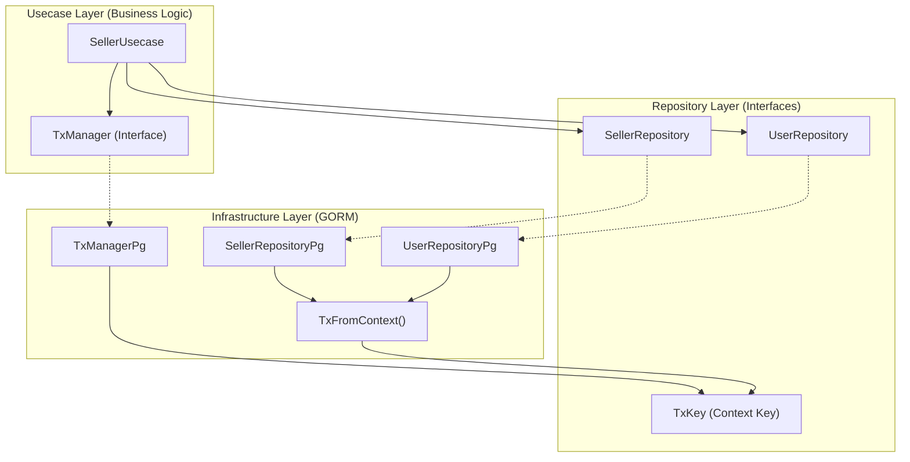

# Transaction Management in Clean Architecture

This document explains how our transaction implementation maintains Clean Architecture principles.

## The Problem

In `RegisterSeller`, we need two operations to be atomic:
1. Create a new Seller record
2. Update User's role to "seller"

If either fails, both should rollback. Without transactions, a failed role update would leave an orphaned seller record.

## Solution Overview



## File Structure

| File | Layer | Purpose |
|------|-------|---------|
| `repository/tx.go` | Repository (Interface) | Defines `TxManager` interface and `TxKey` |
| `repository/pg/tx_pg.go` | Infrastructure | GORM implementation of `TxManager` |
| `usecase/seller_usecase.go` | Usecase | Uses `TxManager` interface for transactions |

## How It Works

### 1. Abstract Interface ([tx.go](file:///d:/Proyek/Tugas%20Startup/backend/internal/repository/tx.go))

```go
type TxManager interface {
    WithTransaction(ctx context.Context, fn func(txCtx context.Context) error) error
}
```

The usecase layer depends on this **interface**, not GORM.

### 2. GORM Implementation ([tx_pg.go](file:///d:/Proyek/Tugas%20Startup/backend/internal/repository/pg/tx_pg.go))

```go
func (t *TxManagerPg) WithTransaction(ctx context.Context, fn func(txCtx context.Context) error) error {
    return t.db.Transaction(func(tx *gorm.DB) error {
        txCtx := context.WithValue(ctx, repository.TxKey{}, tx)
        return fn(txCtx)
    })
}
```

The transaction is stored in context using `TxKey`.

### 3. Repositories Check Context

```go
func TxFromContext(ctx context.Context, defaultDB *gorm.DB) *gorm.DB {
    if tx, ok := ctx.Value(repository.TxKey{}).(*gorm.DB); ok {
        return tx
    }
    return defaultDB
}
```

Repositories use `TxFromContext` - if a transaction exists in context, use it; otherwise use the default DB.

### 4. Usage in Usecase ([seller_usecase.go](file:///d:/Proyek/Tugas%20Startup/backend/internal/usecase/seller_usecase.go))

```go
err = s.tx.WithTransaction(ctx, func(txCtx context.Context) error {
    seller, txErr = s.repo.CreateSeller(txCtx, &entity.Seller{...})
    if txErr != nil {
        return txErr  // Rollback
    }
    
    user.Role = "seller"
    _, txErr = s.user.Update(txCtx, user)
    return txErr  // Rollback on error, commit on nil
})
```

## Why This Satisfies Clean Architecture

### ✅ Dependency Rule Preserved

```
Usecase Layer → Repository Interface ← Infrastructure Layer
     ↓                                        ↑
  TxManager (interface)              TxManagerPg (GORM)
```

- Usecase depends on `repository.TxManager` (interface)
- Usecase has **no knowledge** of GORM
- `TxManagerPg` is injected via dependency injection

### ✅ Layers Remain Independent

| Layer | Knows About | Does NOT Know About |
|-------|-------------|---------------------|
| Usecase | `TxManager` interface | GORM, PostgreSQL |
| Repository Interface | Context, Entities | GORM, any DB driver |
| Infrastructure | GORM, Context key | Business logic |

### ✅ Testability

The usecase can be unit tested with a mock `TxManager`:

```go
type MockTxManager struct{}

func (m *MockTxManager) WithTransaction(ctx context.Context, fn func(txCtx context.Context) error) error {
    return fn(ctx)  // Just execute without real transaction
}
```

### ✅ Swappable Infrastructure

To switch from PostgreSQL to MySQL or MongoDB:
1. Create new `TxManagerMongo` implementing `TxManager`
2. Update DI in `bootstrap.go`
3. Usecase code remains unchanged

## Summary

| Principle | How We Satisfy It |
|-----------|-------------------|
| **Dependency Inversion** | Usecase depends on `TxManager` interface, not GORM |
| **Separation of Concerns** | Transaction logic isolated in `tx_pg.go` |
| **Single Responsibility** | `TxManager` only handles transaction lifecycle |
| **Interface Segregation** | Small, focused `TxManager` interface |
| **Testability** | Mock `TxManager` for unit tests |
