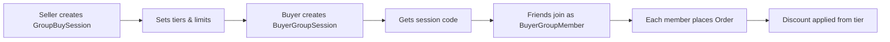

# Database Schema Documentation

## Quick Links
- [ERD Diagram](#entity-relationship-diagram)
- [Table Details](#table-details-by-domain)
- [Raw Mermaid Code](#raw-mermaid-code-for-mermaidlive)

---

## Entity Relationship Diagram

```mermaid
erDiagram
    users ||--o{ auth_providers : "has"
    users ||--o{ refresh_tokens : "has"
    users ||--o{ addresses : "has"
    users ||--o| sellers : "can be"
    users ||--o{ orders : "places"
    users ||--o{ product_reviews : "writes"
    users ||--o{ seller_reviews : "writes"
    users ||--o{ user_favorites : "has"
    users ||--o{ carts : "has"
    users ||--o{ stock_reservations : "has"
    users ||--o{ buyer_group_sessions : "organizes"
    users ||--o{ buyer_group_members : "joins"
    users ||--o{ group_buy_participants : "participates"

    sellers ||--o{ products : "sells"
    sellers ||--o{ group_buy_sessions : "creates"
    sellers ||--o{ orders : "fulfills"
    sellers ||--o{ seller_payouts : "receives"
    sellers ||--o{ seller_commissions : "earns"
    sellers ||--o{ seller_reviews : "receives"

    categories ||--o{ products : "contains"
    categories ||--o| categories : "parent of"

    products ||--o{ product_variants : "has"
    products ||--o{ product_images : "has"
    products ||--o{ product_reviews : "has"

    product_variants ||--|| product_variant_stocks : "has"
    product_variants ||--o{ inventory_ledgers : "tracked by"
    product_variants ||--o{ stock_reservations : "reserved in"
    product_variants ||--o{ cart_items : "added to"
    product_variants ||--o{ order_items : "ordered in"
    product_variants ||--o| group_buy_sessions : "featured in"
    product_variants ||--o{ buyer_group_sessions : "selected in"
    product_variants ||--o{ user_favorites : "favorited in"

    group_buy_sessions ||--o{ group_buy_tiers : "has"
    group_buy_sessions ||--o{ buyer_group_sessions : "spawns"
    group_buy_sessions ||--o{ group_buy_participants : "has"
    group_buy_sessions ||--o{ orders : "generates"

    buyer_group_sessions ||--o{ buyer_group_members : "has"

    carts ||--o{ cart_items : "contains"

    orders ||--o{ order_items : "contains"
    orders ||--o| order_shipping_details : "ships to"
    orders ||--o{ order_adjustments : "has"
    orders ||--o| payments : "paid via"
    orders ||--o{ seller_commissions : "generates"
    orders ||--o{ seller_reviews : "reviewed in"
    orders ||--o{ stock_reservations : "reserves"
    orders ||--o{ inventory_ledgers : "logged in"
    orders ||--o{ buyer_group_members : "fulfilled by"

    seller_payouts ||--o{ seller_commissions : "includes"

    users { bigint id PK }
    auth_providers { bigint id PK }
    refresh_tokens { varchar token_id PK }
    addresses { uuid address_id PK }
    sellers { bigint id PK }
    seller_payouts { uuid id PK }
    seller_commissions { uuid id PK }
    seller_reviews { uuid id PK }
    categories { bigint id PK }
    products { uuid id PK }
    product_variants { uuid id PK }
    product_variant_stocks { uuid product_variant_id PK }
    product_images { uuid id PK }
    product_reviews { uuid id PK }
    user_favorites { uuid id PK }
    inventory_ledgers { bigint id PK }
    stock_reservations { uuid id PK }
    group_buy_sessions { uuid id PK }
    group_buy_tiers { uuid id PK }
    group_buy_participants { uuid id PK }
    buyer_group_sessions { uuid id PK }
    buyer_group_members { uuid id PK }
    carts { uuid id PK }
    cart_items { uuid id PK }
    orders { uuid id PK }
    order_items { uuid id PK }
    order_adjustments { uuid id PK }
    order_shipping_details { uuid id PK }
    payments { uuid id PK }
    coupons { uuid id PK }
```



---

## Table Details by Domain

### User & Auth (4 tables)

| Table | Description |
|-------|-------------|
| `users` | Main user accounts |
| `auth_providers` | OAuth providers (Google, etc) |
| `refresh_tokens` | JWT refresh tokens |
| `addresses` | User shipping addresses |

### Seller (4 tables)

| Table | Description |
|-------|-------------|
| `sellers` | Seller profiles linked to users |
| `seller_payouts` | Payout records to sellers |
| `seller_commissions` | Commission per order item |
| `seller_reviews` | Reviews for sellers |

### Product (7 tables)

| Table | Description |
|-------|-------------|
| `categories` | Product categories (hierarchical) |
| `products` | Main product records |
| `product_variants` | SKU variants with price |
| `product_variant_stocks` | Stock levels per variant |
| `product_images` | Product images |
| `product_reviews` | Product reviews |
| `user_favorites` | User wishlists |

### Inventory (2 tables)

| Table | Description |
|-------|-------------|
| `inventory_ledgers` | Stock change history |
| `stock_reservations` | Temporary stock holds |

### Group Buy - Seller (3 tables)

| Table | Description |
|-------|-------------|
| `group_buy_sessions` | Seller-created campaigns |
| `group_buy_tiers` | Discount tiers by participant count |
| `group_buy_participants` | Direct participants |

### Group Buy - Buyer (2 tables)

| Table | Description |
|-------|-------------|
| `buyer_group_sessions` | Buyer-created shareable sessions |
| `buyer_group_members` | Users who joined via code |

### Cart (2 tables)

| Table | Description |
|-------|-------------|
| `carts` | Shopping carts |
| `cart_items` | Items in cart |

### Orders & Payments (6 tables)

| Table | Description |
|-------|-------------|
| `orders` | Order records |
| `order_items` | Items per order |
| `order_adjustments` | Discounts applied |
| `order_shipping_details` | Shipping info |
| `payments` | Payment records |
| `coupons` | Discount codes |

---

## Group Buy Flow



---

## Raw Mermaid Code for mermaid.live

Copy the code below and paste it at [mermaid.live](https://mermaid.live):

```
erDiagram
    users ||--o{ auth_providers : "has"
    users ||--o{ refresh_tokens : "has"
    users ||--o{ addresses : "has"
    users ||--o| sellers : "can be"
    users ||--o{ orders : "places"
    users ||--o{ product_reviews : "writes"
    users ||--o{ seller_reviews : "writes"
    users ||--o{ user_favorites : "has"
    users ||--o{ carts : "has"
    users ||--o{ stock_reservations : "has"
    users ||--o{ buyer_group_sessions : "organizes"
    users ||--o{ buyer_group_members : "joins"
    users ||--o{ group_buy_participants : "participates"

    sellers ||--o{ products : "sells"
    sellers ||--o{ group_buy_sessions : "creates"
    sellers ||--o{ orders : "fulfills"
    sellers ||--o{ seller_payouts : "receives"
    sellers ||--o{ seller_commissions : "earns"
    sellers ||--o{ seller_reviews : "receives"

    categories ||--o{ products : "contains"
    categories ||--o| categories : "parent of"

    products ||--o{ product_variants : "has"
    products ||--o{ product_images : "has"
    products ||--o{ product_reviews : "has"

    product_variants ||--|| product_variant_stocks : "has"
    product_variants ||--o{ inventory_ledgers : "tracked by"
    product_variants ||--o{ stock_reservations : "reserved in"
    product_variants ||--o{ cart_items : "added to"
    product_variants ||--o{ order_items : "ordered in"
    product_variants ||--o| group_buy_sessions : "featured in"
    product_variants ||--o{ buyer_group_sessions : "selected in"
    product_variants ||--o{ user_favorites : "favorited in"

    group_buy_sessions ||--o{ group_buy_tiers : "has"
    group_buy_sessions ||--o{ buyer_group_sessions : "spawns"
    group_buy_sessions ||--o{ group_buy_participants : "has"
    group_buy_sessions ||--o{ orders : "generates"

    buyer_group_sessions ||--o{ buyer_group_members : "has"

    carts ||--o{ cart_items : "contains"

    orders ||--o{ order_items : "contains"
    orders ||--o| order_shipping_details : "ships to"
    orders ||--o{ order_adjustments : "has"
    orders ||--o| payments : "paid via"
    orders ||--o{ seller_commissions : "generates"
    orders ||--o{ seller_reviews : "reviewed in"
    orders ||--o{ stock_reservations : "reserves"
    orders ||--o{ inventory_ledgers : "logged in"
    orders ||--o{ buyer_group_members : "fulfilled by"

    seller_payouts ||--o{ seller_commissions : "includes"

    users {
        bigint id PK
        varchar username UK
        varchar first_name
        varchar last_name
        varchar phone_number UK
        varchar email UK
        text role
        varchar profile_url
        timestamptz created_at
        timestamptz updated_at
    }

    auth_providers {
        bigint auth_provider_id PK
        bigint user_id FK
        varchar provider
        varchar provider_id UK
        varchar password
    }

    refresh_tokens {
        varchar token_id PK
        bigint user_id FK
        varchar token_hash UK
        text role
        bool is_revoked
        varchar device_info
        timestamptz expires_at
        timestamptz created_at
    }

    addresses {
        uuid address_id PK
        bigint user_id FK
        varchar address_label
        varchar receiver_name
        text street_address
        varchar village
        varchar district
        varchar city
        varchar province
        varchar postal_code
        text notes
        bool is_default
        timestamptz created_at
        timestamptz updated_at
    }

    sellers {
        bigint id PK
        bigint user_id FK
        varchar store_name
        varchar store_slug UK
        text description
        varchar logo_url
        varchar business_email
        varchar business_phone
        text status
        bool is_verified
        decimal average_rating
        int total_sales
        timestamptz created_at
        timestamptz updated_at
    }

    seller_payouts {
        uuid id PK
        bigint seller_id FK
        decimal amount
        text status
        text payment_method
        varchar transaction_id
        timestamptz processed_at
        timestamptz created_at
    }

    seller_commissions {
        uuid id PK
        bigint seller_id FK
        uuid order_id FK
        uuid order_item_id FK
        decimal sale_amount
        decimal commission_rate
        decimal commission_amount
        decimal seller_earnings
        text status
        uuid payout_id FK
        timestamptz paid_at
        timestamptz created_at
    }

    seller_reviews {
        uuid id PK
        bigint seller_id FK
        bigint user_id FK
        uuid order_id FK
        int rating
        text review_text
        int communication_rating
        int shipping_rating
        int product_rating
        timestamptz created_at
        timestamptz updated_at
    }

    categories {
        bigint id PK
        varchar name
        varchar slug UK
        text description
        bigint parent_id FK
        timestamptz created_at
        timestamptz updated_at
    }

    products {
        uuid id PK
        bigint seller_id FK
        varchar title
        varchar slug UK
        jsonb description
        bigint category_id FK
        varchar badge
        bool is_active
        text status
        timestamptz created_at
        timestamptz updated_at
    }

    product_variants {
        uuid id PK
        uuid product_id FK
        varchar sku UK
        varchar name
        decimal price
        bool is_active
        timestamptz created_at
        timestamptz updated_at
    }

    product_variant_stocks {
        uuid product_variant_id PK
        int current_stock
        int reserved_stock
        int low_stock_threshold
        int version
        timestamptz last_updated
    }

    product_images {
        uuid id PK
        uuid product_id FK
        varchar image_url
        varchar alt_text
        int display_order
        bool is_primary
        timestamptz created_at
    }

    product_reviews {
        uuid id PK
        uuid product_id FK
        bigint user_id FK
        int rating
        text review_text
        timestamptz created_at
        timestamptz updated_at
    }

    user_favorites {
        uuid id PK
        bigint user_id FK
        uuid product_variant_id FK
        timestamptz created_at
    }

    inventory_ledgers {
        bigint id PK
        uuid product_variant_id FK
        int quantity_change
        varchar reason
        varchar reference_type
        uuid reference_id
        uuid order_id FK
        timestamptz created_at
    }

    stock_reservations {
        uuid id PK
        uuid product_variant_id FK
        bigint user_id FK
        uuid order_id FK
        int quantity
        text status
        timestamptz expires_at
        timestamptz created_at
    }

    group_buy_sessions {
        uuid id PK
        uuid product_variant_id FK
        bigint seller_id FK
        int min_participants
        int max_participants
        text status
        bigint max_quantity
        timestamptz expires_at
        timestamptz created_at
        timestamptz updated_at
    }

    group_buy_tiers {
        uuid id PK
        uuid group_buy_session_id FK
        int participant_threshold
        decimal discount_percentage
    }

    group_buy_participants {
        uuid id PK
        uuid session_id FK
        bigint user_id FK
        int quantity
        timestamptz joined_at
    }

    buyer_group_sessions {
        uuid id PK
        uuid group_buy_session_id FK
        varchar session_code UK
        bigint organizer_user_id FK
        uuid product_variant_id FK
        varchar title
        int current_participants
        text status
        timestamptz expires_at
        timestamptz created_at
        timestamptz updated_at
    }

    buyer_group_members {
        uuid id PK
        uuid session_id FK
        bigint user_id FK
        uuid order_id FK
        int quantity
        text status
        timestamptz joined_at
    }

    carts {
        uuid id PK
        bigint user_id FK
        varchar session_id UK
        timestamptz created_at
        timestamptz updated_at
    }

    cart_items {
        uuid id PK
        uuid cart_id FK
        uuid product_variant_id FK
        int quantity
        timestamptz created_at
        timestamptz updated_at
    }

    orders {
        uuid id PK
        varchar order_number UK
        bigint user_id FK
        uuid group_buy_session_id FK
        bigint seller_id FK
        decimal subtotal
        decimal delivery_charge
        decimal total_amount
        text status
        timestamptz created_at
        timestamptz updated_at
    }

    order_items {
        uuid id PK
        uuid order_id FK
        uuid product_variant_id FK
        int quantity
        decimal price_at_purchase
        decimal total_price
        timestamptz created_at
    }

    order_adjustments {
        uuid id PK
        uuid order_id FK
        varchar description
        decimal amount
        text source_type
        uuid source_id
        timestamptz created_at
    }

    order_shipping_details {
        uuid id PK
        uuid order_id FK
        varchar full_name
        varchar phone
        varchar address_line1
        varchar address_line2
        varchar city
        varchar state
        varchar postal_code
        varchar country
    }

    payments {
        uuid id PK
        uuid order_id FK
        decimal amount
        text status
        varchar payment_method
        varchar gateway_transaction_id
        timestamptz created_at
        timestamptz updated_at
    }

    coupons {
        uuid id PK
        varchar code UK
        text discount_type
        decimal discount_value
        decimal min_purchase_amount
        decimal max_discount_amount
        timestamptz valid_from
        timestamptz valid_until
        int usage_limit
        int usage_count
        bool is_active
        timestamptz created_at
    }
```