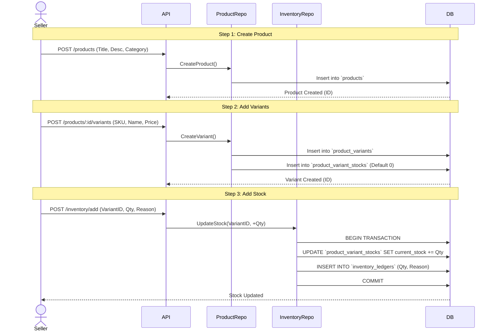
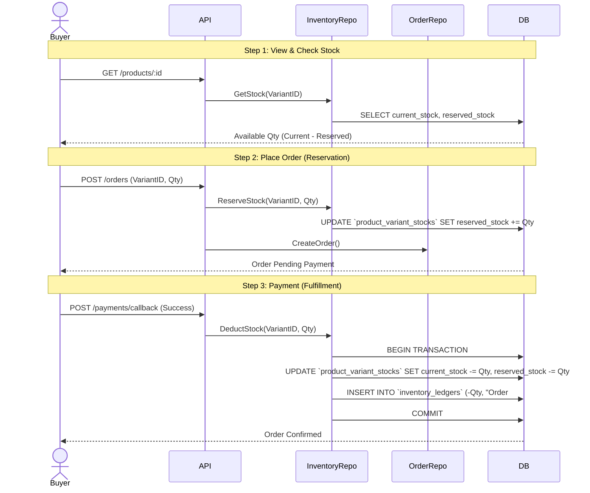

# Product & Inventory User Flow

This document outlines the user flows for the Product and Inventory system based on the current database schema.

## 1. Seller: Product Creation & Inventory Management

### Flow Description
1.  **Create Product**: Seller defines the main product details (Title, Description, Category).
2.  **Create Variants**: Seller adds variations (e.g., Size S, Color Red).
    *   *System Action*: Automatically initializes `ProductVariantStock` with 0 stock.
3.  **Initial Stocking**: Seller adds initial stock to the variants.
    *   *System Action*: Updates `ProductVariantStock` and records `InventoryLedger`.

### Diagram

## 2. Buyer: Browsing & Purchasing

### Flow Description
1.  **View Product**: Buyer sees product details and available variants.
2.  **Check Availability**: System checks `CurrentStock` - `ReservedStock`.
3.  **Add to Cart**: Buyer adds item to cart.
4.  **Checkout (Reservation)**: When order is placed, stock is reserved.
    *   *System Action*: `ReservedStock` increases.
5.  **Payment Success (Deduction)**: When payment is confirmed, stock is permanently deducted.
    *   *System Action*: `CurrentStock` decreases, `ReservedStock` decreases.

### Diagram

## 3. Edge Cases

*   **Order Cancellation/Timeout**:
    *   If the user doesn't pay within the time limit, `ReleaseStock` is called.
    *   `ReservedStock` -= Qty.
*   **Restocking**:
    *   Seller adds more stock. `CurrentStock` += Qty.
